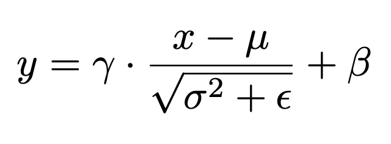
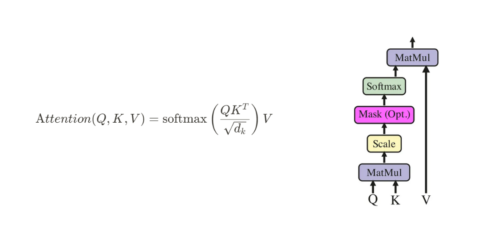

# Assignment: Autoregressive

This assignment is part of the **Machine Learning course at POSTECH**, focusing on implementing the core components of a Transformer model using **NumPy**.

## Overview

The goal of this assignment is to implement and understand the key building blocks that constitute a modern **Decoder-only Transformer** architecture.  
Students will implement and document each submodule from scratch—without relying on external deep learning frameworks—while adhering to the provided module interfaces.

### Covered Topics

- **Neural network layers:** Layer Normalization, Feed-Forward Networks  
- **Attention mechanisms:** Scaled Dot-Product and Multi-Head Attention  
- **Sequence modeling:** Positional Encoding (decoder-only)  
- **Transformer architecture:** Decoder-only pipeline with forward/backward passes

## Tasks Breakdown

### 1. Layer Normalization (`LayerNorm`)

Normalizes only the last feature axis D per sample/token; batch/time axes are not included.

**Features:**

- Computes: `y = gamma * (x - mean(x)) / sqrt(var(x) + eps) + beta`
- Learnable parameters: `weights`, `bias`
- Numerical stability: `eps` default is **1e-5**

### 2. Feed-Forward (`FeedForward`)

Two-layer non-linear projection module used in Transformer blocks.

**Features:**

- Implements: `FFN(x) = W2 * ReLU(W1 * x + b1) + b2`
- Composed of two `Linear` layers and one activation module (`ReLU`)
- Fully differentiable forward/backward computation

### 3. Positional Encoding (`PositionalEncoding`)

Adds deterministic position information to token embeddings.

**Features:**

- Sinusoidal encoding:
  - `PE[n, 2k] = sin(n / 10000^(2k/D))`
  - `PE[n, 2k+1] = cos(n / 10000^(2k/D))`
- No learnable parameters
- Added to embeddings before the **decoder** stack

### 4. Attention Mechanisms

#### (a) Scaled Dot-Product Attention (`ScaledSelfAttention`)

**Features:**

- Computes: `Attention(Q, K, V) = softmax(Q K^T / sqrt(dk)) V`, where `Q = X W_Q, K = X W_K, V = X W_V`
- **Causal self-attention (decoder-only)**: when `causal=True`, an upper-triangular mask is added **before softmax** using a large negative constant **−1e9** (numerically equivalent to −∞).  
  In **backward**, gradients of the masked entries in the score tensor are set to **0** to match the forward mask.
- Full backward computation for gradient-based learning
- Random initialization of `W_Q, W_K, W_V`

#### (b) Multi-Head Attention (`MultiHeadAttention`)

**Features:**

- Parallel heads:
  - `MHA(Q, K, V) = concat(head_1, ..., head_h) * W_O`
- Per-head backward propagation
- Used in **Decoder** layers  
- **Decoder-only note**: construct attention with **`causal=True`** so the stack enforces autoregressive masking.

### 5. Decoder Layers

#### Decoder Layer (`DecoderLayer`)

**Composition:**

- Masekd-Attention → Add & Norm → Feed-Forward → Add & Norm

**Features:**

- Same residual/normalization structure

### 6. Decoder

#### Decoder (`Decoder`)

**Features:**

- Embeds target tokens → adds positional encodings → stacked `DecoderLayer`s  
- Final linear head outputs vocabulary logits `(T_trg, V)`

## Technical Details

### Tree-Based Parameter Management

Parameters are organized into **tree dictionaries**, enabling composable and recursive updates via functional optimizers (e.g., SGD, Adam).

### Protocols and Interfaces

All modules conform to the `mlp` framework’s `Module`/`Optimizer`/`Loss` protocols.  
Each component provides:

- `forward()` and `backward()`  
- `parameters` and `with_parameters()`  
- Optional `create()` factory for reproducible init

**Decoder-only masking note**: when constructing attention modules for this stack, pass **`causal=True`** so the upper-triangular mask is applied in forward (via −1e9 pre-softmax) and respected in backward (masked score-grads set to 0).

## Assignment Objectives

1. **Transformer internals** — how components interact  
2. **Differentiable programming** — correct gradients  
3. **Modular software design** — reusable, documented components  
4. **Numerical stability** — robust floating-point ops  
5. **Documentation & testing** — clear docstrings, reproducible tests

## What You Must Implement

All components required to build a Transformer:

- `LayerNorm`
- `FeedForward` (FFN)
- `PositionalEncoding`
- `ScaledSelfAttention`, `MultiHeadAttention`
- `DecoderLayer`, `Decoder`

## Submission

1. Implement code in [`autoregressive/__init__.py`](autoregressive/__init__.py).
2. Validate your implementation by running the tests in the `tests` directory using pytest.
   1. Please ensure all public tests pass before submitting your assignment.
3. Submit only [`autoregressive/__init__.py`](__init__.py) to the course platform.
   1. Submissions in any other format will not be accepted and will result in a score of zero.

## Credits

- Junyoung Yang
  - <mailto:sheepjun0330@postech.ac.kr>
